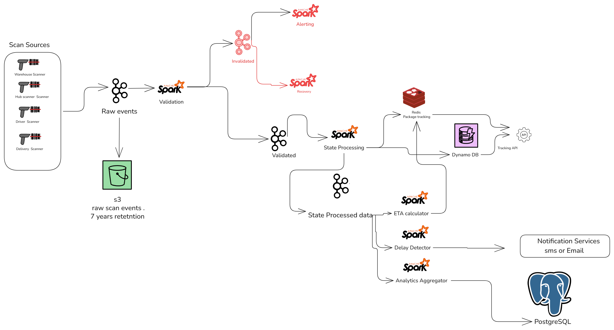

# Supply-chain-and-Package-tracking-data-pipeline

# Introduction & Goals

Every package that moves through a supply chain generates a trail of scans which are picked up at the warehouse, sorted at a hub, loaded onto a truck, dropped at the door. This project simulates that trail and builds the pipeline to turn it into live, trustworthy tracking: synthetic scan events from four scanner types (warehouse, hub, driver, delivery) are streamed through Kafka, validated and reconstructed into per-package state with Spark Structured Streaming and served to a tracking API backed by DynamoDB and Redis — while a separate path feeds ETA prediction, delay detection and analytics.

The interesting engineering problem isn't the happy path but it's that scanners go offline. A driver's handheld scanner in a dead zone doesn't lose its scan, it buffers it and uploads late, with the *original* scan time attached. That means events arrive out of order and the pipeline has to reconstruct the correct sequence using event-time processing rather than trusting the order things showed up in.
 

 
**Goal 1:** A package's tracked status should reflect reality even when the scan that produced it arrived late or out of order.
**How I know it worked:** State updates from a validated scan appear in the tracking API within 2 minutes of that scan being processed, regardless of how late it arrived relative to when it actually happened.
 
**Goal 2:** Bad data should never corrupt a package's tracked state.
**How I know it worked:** 100% of malformed events (bad `package_id` format, null `location_id`, unrecognized `scan_type`) are routed to a dead-letter path and never reach the state store this is verified by injecting a known percentage of corrupted events at the generator and confirming none leak through.
 
**Goal 3:** Delays should be caught before a customer would notice.
**How I know it worked:** A package that misses its expected scan window triggers a delay alert within 30 minutes of the threshold being breached.
 
## Architecture

 
The pipeline has four stages: **ingestion** (scanners → Kafka, partitioned by `package_id` so one package's events always land in order), **validation** (a stateless Spark job splitting clean events from bad ones), **state processing** (a stateful Spark job reconstructing each package's true state using event-time watermarking), and **fan-out** (the validated state stream feeding a customer-facing read path plus independent ETA, delay-detection, and analytics consumers)

## Table of Contents
 
- [Architecture](#architecture)
- [Data Flow](#data-flow)
- [Services](#services)
- [Prerequisites](#prerequisites)
- [Local Development (Docker Compose)](#local-development-docker-compose)
- [Environment Variables](#environment-variables)
- [AWS Deployment (Terraform)](#aws-deployment-terraform)
- [Monitoring](#monitoring)
- [Troubleshooting](#troubleshooting)
- [Project Structure](#project-structure)
---

## Data Flow
 
1. **`kafka-producer`** publishes simulated package scan events to the `package_events`
   Kafka topic.
2. **`spark-validation`** consumes `package_events`, validates each event against a set
   of rules (package ID format, valid scan type, non-empty location/device IDs, valid
   timestamp), and:
   - Writes **valid** events to `scan_events_validated` (Kafka) and to S3 as
     partitioned Parquet (`year/month/day/scan_type`).
   - Writes **invalid** events to `scan_events_dlq` (a dead-letter queue) with the
     specific validation errors attached.
3. **`spark-state-processing-job`** consumes `scan_events_validated`, maintains the
   current state of each package (using Redis for fast lookups and DynamoDB for
   durable state), and emits to `state-processed-data`.
4. **`spark-eta-calculator-job`** consumes `state-processed-data`, calculates an
   estimated delivery time per package using Kenya-specific location data, and emits
   to `eta-calculated-data`.
5. **`spark-delay-detector`** consumes `state-processed-data`, flags packages exceeding
   a configurable delay threshold, and emits to `delay-notifications`.
6. **`spark-analytics-aggregator`** consumes downstream topics and produces rollup
   metrics for dashboards.
Throughout, **Kafdrop** gives visibility into Kafka topics, and **Prometheus +
Grafana** track pipeline health.
 
## Services
 
| Service | Purpose |
|---|---|
| `kafka1`, `kafka2` | Kafka brokers (KRaft mode, no ZooKeeper) |
| `schema-registry` | Confluent Schema Registry |
| `kafdrop` | Web UI for browsing Kafka topics |
| `kafka-producer` | Generates simulated package scan events |
| `spark-master`, `spark-worker1`–`6` | Spark standalone cluster |
| `spark-validation` | Validates incoming scan events, splits valid/invalid |
| `spark-state-processing-job` | Tracks current package state |
| `spark-eta-calculator-job` | Calculates estimated delivery times |
| `spark-delay-detector` | Flags delayed packages |
| `spark-analytics-aggregator` | Produces aggregate analytics |
| `postgres`, `pgadmin` | Relational store + admin UI |
| `redis` | Fast key-value store for live package state |
| `dynamodb-local` | Local DynamoDB emulator for durable state |
| `prometheus`, `grafana`, `alertmanager` | Metrics collection, dashboards, alerting |
| `kafka-exporters` | Exposes Kafka metrics to Prometheus |
| `cadvisor` | Container resource metrics |
 
## Prerequisites
 
- [Docker](https://docs.docker.com/get-docker/) and Docker Compose v2 (`docker compose version`)
- An AWS account with an S3 bucket you control (for validated/malformed data output)
- AWS access key + secret key with S3 read/write permissions on that bucket
- (For AWS deployment) [Terraform](https://developer.hashicorp.com/terraform/downloads) ≥ 1.5, and an AWS CLI profile configured

## Local Development (Docker Compose)
 
1. **Clone the repo:**
```bash
   git clone https://github.com/BretaOsodo/Supply-chain-and-Package-tracking-data-pipeline.git
   cd Supply-chain-and-Package-tracking-data-pipeline
```
 
2. **Create your `.env` file** in the project root (see [Environment Variables](#environment-variables)
   below for the full list). This file is git-ignored — never commit it.
3. **Start everything:**
```bash
   docker compose up -d --build
```
   Services boot in dependency order; the Spark job containers `sleep` for a staggered
   interval before running `spark-submit`, giving the cluster and Kafka brokers time to
   become healthy first.
 
4. **Check status:**
```bash
   docker compose ps
   docker compose logs -f spark-validation
```
 
5. **Access the UIs** (all bound to `127.0.0.1` only, by default):
   | UI | URL |
   |---|---|
   | Kafdrop (Kafka topics) | http://localhost:9020 |
   | Spark Master | http://localhost:9090 |
   | Grafana | http://localhost:3000 |
   | Prometheus | http://localhost:9096 |
   | pgAdmin | http://localhost:`${PGADMIN_PORT}` |
6. **Stop everything:**
```bash
   docker compose down
```
   Add `-v` to also remove named volumes (Kafka data, checkpoints, Postgres data) —
   use with care, this wipes all local state.
 
### First-run permissions note
 
The Spark job containers run as a non-root `spark` user, but `spark-checkpoints` is a
shared named Docker volume that Docker creates owned by `root` on first use. If you see
`mkdir of file:/spark/checkpoints/... failed` errors on first boot, fix ownership once:
 
```bash
docker compose run --rm --user root spark-eta-calculator-job \
  "mkdir -p /spark/checkpoints && chown -R spark:spark /spark/checkpoints"
docker compose up -d --force-recreate
```
 
## Environment Variables
 
Create a `.env` file in the project root (plain UTF-8, no BOM, no `export` keyword,
no quotes) with:
 
```env
# AWS — used by Spark jobs writing to S3
AWS_ACCESS_KEY=your_access_key_id
AWS_SECRET_KEY=your_secret_access_key
AWS_REGION=eu-north-1
 
# Postgres
POSTGRES_SCHEMA=your_db_name
POSTGRES_USER=your_db_user
POSTGRES_PASSWORD=your_db_password
HOST_PORT=5432
 
# pgAdmin
PGADMIN_EMAIL=you@example.com
PGADMIN_PASSWORD=your_pgadmin_password
PGADMIN_PORT=5050
 
# Redis
REDIS_PASSWORD=your_redis_password
```
 
> **Note:** each service in `docker-compose.yml` that needs AWS credentials
> (`spark-master`, `spark-validation`, `spark-state-processing-job`,
> `spark-eta-calculator-job`, `spark-delay-detector`, `spark-analytics-aggregator`)
> must have its own `environment:` block referencing `${AWS_ACCESS_KEY}` /
> `${AWS_SECRET_KEY}` — Compose does **not** propagate `.env` values into a container
> automatically unless the service explicitly references them.
 
## AWS Deployment (Terraform)
 
Infrastructure is split into two Terraform projects to avoid a chicken-and-egg problem
with remote state:
 
```
terraform/
├── backend-bootstrap/   # Creates the S3 state bucket + DynamoDB lock table
└── main/                # Real infrastructure: S3 data buckets, IAM, EC2, security group
```
 
### 1. Bootstrap the remote state backend (apply once, locally)
 
```bash
cd terraform/backend-bootstrap
terraform init
terraform apply
```
 
This creates:
- `supply-chain-tf-state` (S3 bucket for Terraform state)
- `supply-chain-terraform-state-locking` (DynamoDB table for state locking)
### 2. Configure and apply the main infrastructure
 
```bash
cd ../main
cp terraform.tfvars.example terraform.tfvars
```
 
Edit `terraform.tfvars`:
 
```hcl
admin_cidr = "YOUR_PUBLIC_IP/32"   # https://checkip.amazonaws.com
key_name   = "your-ec2-keypair-name"
```
 
If you don't have an EC2 key pair yet:
```bash
aws ec2 create-key-pair \
  --key-name supply-chain-key \
  --query 'KeyMaterial' \
  --output text > supply-chain-key.pem
chmod 400 supply-chain-key.pem   # macOS/Linux/WSL
```
 
Then:
```bash
terraform init
terraform apply
```
 
This provisions:
- `supply-chain-and-package-tracking-validated` and `-malformed-data` S3 buckets
  (versioned, AES256-encrypted)
- An IAM role + instance profile granting the EC2 instance S3 read/write on those buckets
- A security group restricting SSH and admin UI ports to `admin_cidr`
- A Debian 12 EC2 instance that, on boot, installs Docker, clones the repo, and runs
  `docker compose up -d --build` automatically
> **If a bucket already exists** (e.g. from earlier manual testing), import it instead
> of letting Terraform try to create a duplicate:
> ```bash
> terraform import aws_s3_bucket.validated_data supply-chain-and-package-tracking-validated
> ```
 
### 3. Connect to the instance
 
```bash
terraform output instance_public_ip
ssh -i supply-chain-key.pem admin@<instance_public_ip>
```
 
Bootstrap logs are written to `/var/log/supply-chain-user-data.log` on the instance —
check there first if containers aren't coming up as expected.
 
### Secrets note
 
`terraform.tfvars` and `.env` are both git-ignored (`*.tfvars`, `.env`). If either was
ever committed to version control, rotate any exposed credentials (AWS keys, EC2 key
pairs) and consider rewriting git history with `git filter-repo` if the repo is public.
 
## Monitoring
 
- **Grafana** (`:3000`) — dashboards provisioned from `./monitoring/grafana/`
- **Prometheus** (`:9096`) — scrapes Spark, Kafka (via `kafka-exporters`), and
  container-level (`cadvisor`) metrics
- **Alertmanager** (`:9094`) — routes alerts fired from Prometheus rules
- **Kafdrop** (`:9020`) — inspect topic contents, consumer group lag, partition offsets
## Troubleshooting
 
| Symptom | Likely Cause |
|---|---|
| `mkdir of file:/spark/checkpoints/... failed` | Shared checkpoint volume owned by `root`; see [permissions note](#first-run-permissions-note) above |
| `403 Forbidden` writing to S3 | AWS credentials not reaching the container — verify with `docker exec -it <service> bash -c 'echo $AWS_ACCESS_KEY'` |
| `spark-submit` prints `--help` instead of running | Malformed `command:` block in `docker-compose.yml` — check for stray characters before the `.py` path |
| `ModuleNotFoundError: No module named 'config'` | Dockerfile isn't copying the `config/` folder into the image — check the `COPY` instructions |
| `IllegalArgumentException: <exception str() failed>` on `readStream` | Usually masks a `None`/missing config value; wrap the call and inspect `e.java_exception.getMessage()` directly |
 
## Project Structure
 
```
.
├── docker-compose.yml
├── .env                          # not committed
├── kafka/
│   └── Dockerfile, streaming.py  # event producer
├── spark/
│   ├── Dockerfile
│   ├── config/
│   │   └── config.py
│   ├── validation_job.py
│   ├── state_processing_job.py
│   ├── eta_calculator_job.py
│   ├── delay_detector_job.py
│   └── analytics_aggregator.py
├── monitoring/
│   ├── prometheus/
│   └── grafana/
├── scripts/
│   └── init-db.sh
└── terraform/
      |
      ├── backend.tf
      ├── s3.tf
      ├── iam.tf
      ├── security_group.tf
      ├── variables.tf
      ├── ec2.tf
      ├── user_data.sh
      └── terraform.tfvars      # not committed
```
 
---
 
*Built as a demonstration of a real-time, streaming data pipeline for logistics and
package tracking — validation, state tracking, ETA prediction, delay detection, and
analytics, all running on Spark Structured Streaming over Kafka.*